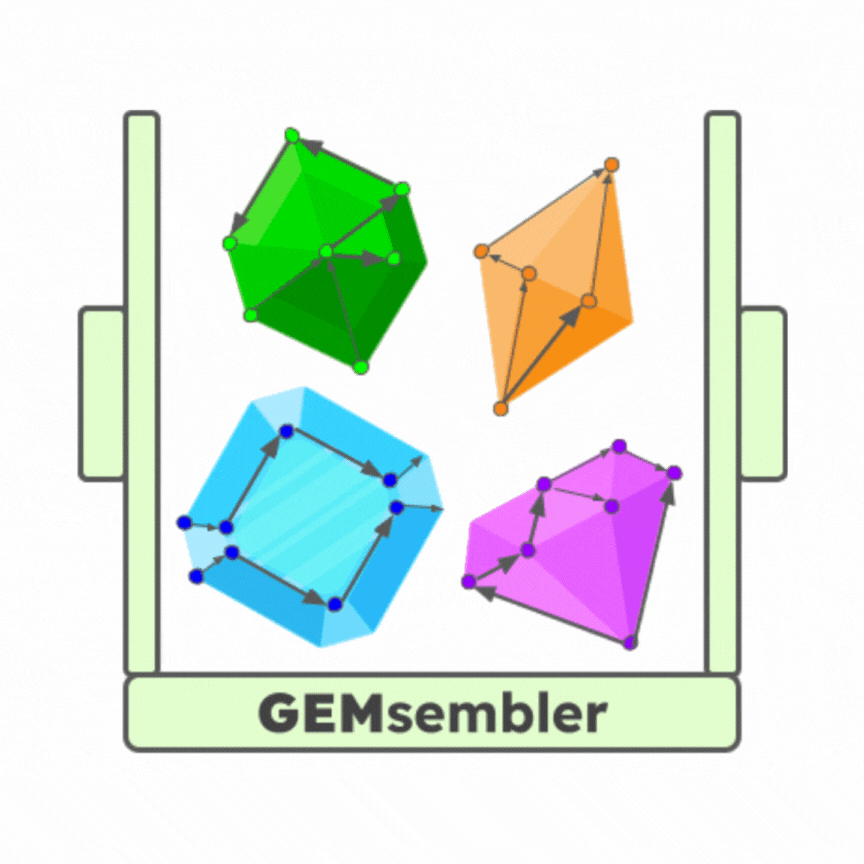

# GEMsembler



GEMsembler tool for assembling and comparing several types of Genome-Scale Metabolic
Models. 

**THIS IS A BETA VERSION! BUGS CAN BE EXPECTED**

**Version 0.9.0 is incompatible with previous versions**

## Installation

Install with the following command:
```
pip install gemsembler
```

**Note:** you also have to install BLAST in advance.

## Usage

Input models have to be COBRApy readable files. And models need to be
particular type. Currently models made by CarveMe (carveme), ModelSEED
(modelseed), gapseq (gapseq) and models downloaded from AGORA VMH database
(agora) are supported. Custom type is coming soon. Genomes, from which the
models are built will allow to convert and assemble genes as well.
First, we import gemsembler and get the path to data files:
```
from gemsembler import GatheredModels, lp_example, get_model_of_interest
```
lp_example is a list with input models and related inforamtion such as model type, corresponding genome and so on.
```
lp_example = [
    dict(
        model_id="curated_LP",
        path_to_model=files(LP) / "LP_iLP728_revision_data_met_C_c.xml.gz",
        model_type="carveme",
        path_to_genome=files(LP) / "LP_protein_fasta.faa.gz",
    ),
    dict(
        model_id="cauniv_LP",
        path_to_model=files(LP) / "LP_CA1.xml.gz",
        model_type="carveme",
        path_to_genome=files(LP) / "LP_protein_fasta.faa.gz",
    ),
    dict(
        model_id="cagram_LP",
        path_to_model=files(LP) / "LP_CA2.xml.gz",
        model_type="carveme",
        path_to_genome=files(LP) / "LP_protein_fasta.faa.gz",
    ),
    dict(
        model_id="msgram_LP",
        path_to_model=files(LP) / "LP_MS2.sbml.gz",
        model_type="modelseed",
        path_to_genome=files(LP) / "LP_protein_fasta.faa.gz",
    ),
    dict(
        model_id="agora_LP",
        path_to_model=files(LP) / "LP_WCFS1_agora.xml.gz",
        model_type="agora",
        path_to_genome=files(LP) / "LP_WCFS1.fasta.gz",
    ),
]
```

First stage is the creation of gathered models, a class, that performs
conversion and contains results of all stages:
```
gathered = GatheredModels()
for model in lp_example:
    gathered.add_model(**model)
gathered.run()
```
Second stage is actual assembly of supermodel from the in formation in gathered
models. User has to provide output folder. And for gene conversion user hast
provide either final genes in fasta. Then all gene will be converted to ids in
these files. Or if user provides NCBI assembly ID for his organism of interest,
corresponding genome will be downloaded automatically and all genes will be
converted to the locus tags of the organism.
```
supermodel_lp = gathered.assemble_supermodel("./gemsembler_output/", assembly_id = "GCF_000203855.3")
```
After supermodel is assembled different comparison methods can be run
```
supermodel_lp.at_least_in(2)
```
And results of comparison can be extracted as typical COBRApy models
```
core2 = get_model_of_interest(supermodel_lp, "core2", "./gemsembler_output/LP_core2_output_model.xml")
```
